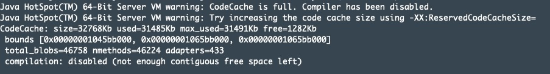

# blade create jvm CodeCacheFilling
## 介绍
CodeCache主要用于存放native code，其中主要是JIT编译后的代码。被JIT编译的一般都是“热代码”，简单说就是调用频率比较高的代码，JIT编译后，代码的执行效率会变高，CodeCache满会导致JVM关闭JIT编译且不可再开启，那么CodeCache满会引起系统运行效率降低，导致系统最大负载下降，当系统流量较大时，可表现为RT增高、QPS下降等。
命令可以简写为：blade c jvm ccf

## 参数
此场景无特有参数，通用参数详见：[blade create jvm](blade create jvm.md)

## 案例
注入 CodeCache 满故障：
```
blade c jvm CodeCacheFilling --process tomcat                                                                          

{"code":200,"success":true,"result":"f0e896f38c704894"}
```




## 实现原理
由于CodeCache主要存放JIT编译的结果，所以填充CodeCache分为两步，第一步是生成用于触发JIT编译的class，方式是通过动态编译生成大量的class；第二步是编译后生成的class进行实例化和频繁调用（“加热”），直到触发JIT编译后进入CodeCache区。通过这样方式不停的填充CodeCache，直到JIT编译关闭

## 常见问题
1. 由于需要编译和“加热”代码，所以在填充的过程中CPU占用率会很高；并且会持续一段时间（测试中，默认大小的情况下，从无占用到填充满约5分钟，实际情况下，CodeCache都会有一定的使用率，所以时间不会那么长）；
2. 由于“加热”过程中需要实例化大量的class，会有大量对象一直无法被GC回收，有概率导致Metaspace满而产生OOM；
3. 由于无法直接判断JIT编译是否关闭，所以只能根据CodeCache占用量来判断，但是JIT编译关闭时，CodeCache占用量的阈值并不能精准获取，所以是通过CodeCache的增长来判断的，如果5秒内CodeCache占用量都无变化，即判断JIT编译关闭（JIT编译关闭后，CodeCache占用量不再变化）；
4. 目前是根据CodeCache的默认大小来设计的（生成class数量等），即240M（jdk8 64bit），如果设置更大的CodeCache（-XX:ReservedCodeCacheSize）的话，持续时间会更长，甚至由于动态产生的class数量不够而导致无法填充满；
5. 由于JIT编译关闭后不可再手工开启，所以该故障无法直接恢复，需要用户手工重启应用系统来恢复；