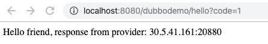
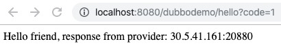

# blade create jvm throwCustomException
## 介绍
指定类方法抛自定义异常，命令可以简写为 `blade c jvm tce`

## 参数
以下是此场景特有参数，通用参数详见：[blade create jvm](blade create jvm.md)
```
--effect-count string     影响的请求条数
--effect-percent string   影响的请求百分比
--exception string           异常类，带全包名，必须继承 java.lang.Exception 或 java.lang.Exception 本身
--exception-message string   指定异常类信息，默认值是 chaosblade-mock-exception
```

## 案例
类名：com.example.controller.DubboController，业务代码如下：
```
private String sayHello(String name) throws BeansException {
    demoService = (DemoService)SpringContextUtil.getBean("demoService");
    StringBuilder result = new StringBuilder();
    result.append(demoService.sayHello(name));
    return result.toString();
}
```

指定以上方法抛出 java.lang.Exception 异常，影响两条请求，命令如下
```
blade c jvm throwCustomException --exception java.lang.Exception --classname com.example.controller.DubboController --methodname sayHello --process tomcat --effect-count 2

{"code":200,"success":true,"result":"3abbe6fe97d6bc75"}
```
验证结果：
注入前：


注入后：


第三次请求后恢复正常：



停止实验：
```
blade d 3abbe6fe97d6bc75
```

## 常见问题
Q: java.lang.Throwable not assign from java.lang.Exception
A: 配置 --exception 参数值 java.lang.Throwable，其不是 java.lang.Exception 的子类

